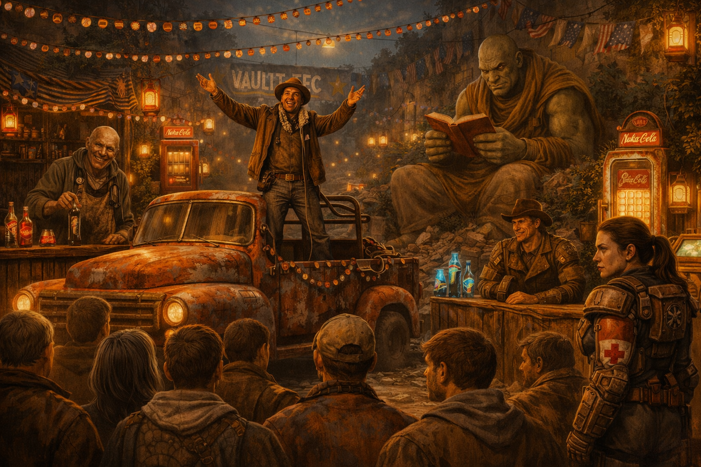
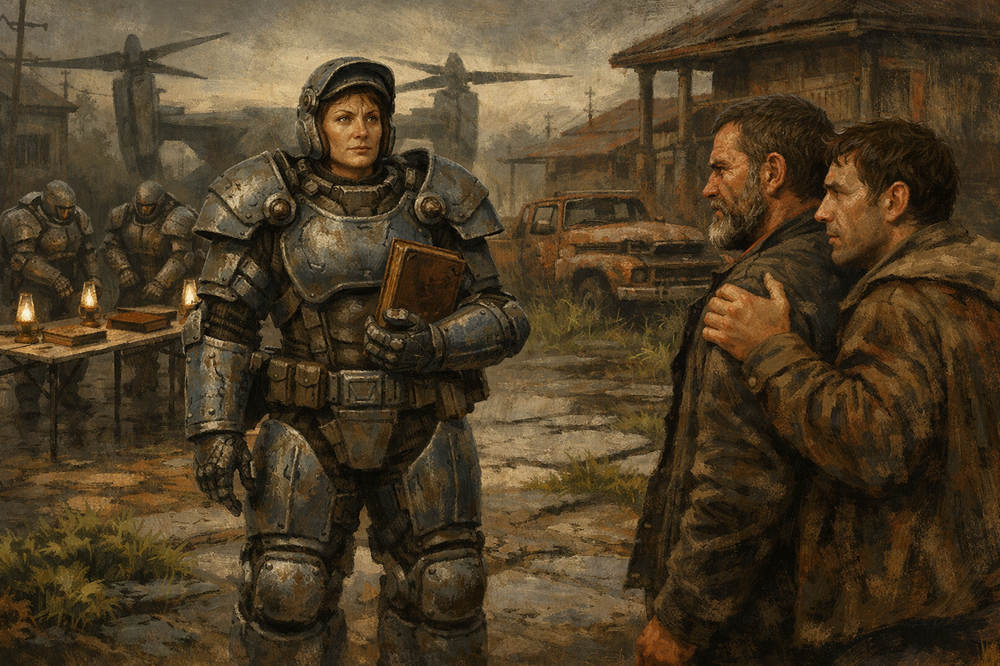

# En fanfare ou en catimini

  
  

Campagne Fallout organisée en deux épisodes.

- `Episode_1/` — joué. Le dossier `Final` repose sur le guide MJ V5 et rassemble les fiches de préparation, dialogues, contexte joueurs et intégration des prétirés.
- `Episode_2/` — jamais joué. Le dossier `Final` contient la préparation « Les couleurs qu’on arbore » et le résumé précédent.
- `Contexte_partage/` — base de campagne commune issue de New Eden.
- `roadmap.md` et `suite_de_laventure.md` — pistes de continuité.
