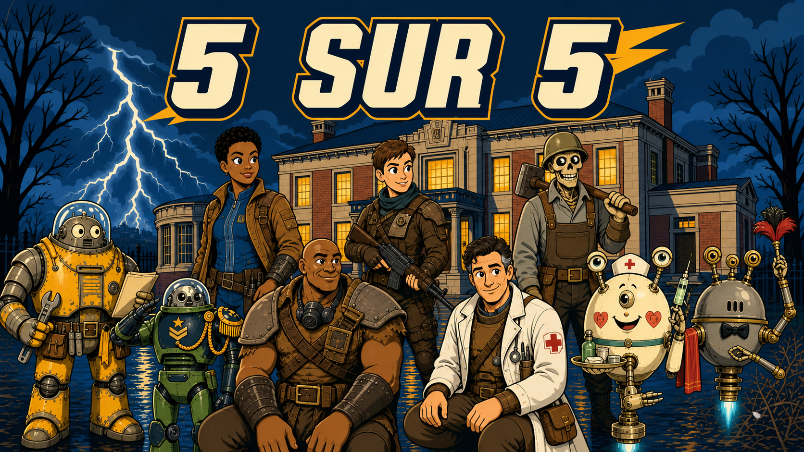

# Bibliothèque MJ

Ce dépôt regroupe les jeux, scénarios et aides de table dans une branche unique.

## Scénarios de jeu de rôle

| Aperçu | Univers | Scénario | Statut | Kit à utiliser |
|---|---|---|---|---|
|  | Fallout | En fanfare ou en catimini — épisode 1 | Joué | `Fallout/En_fanfare_ou_en_catimini/Episode_1/Final/` |
|  | Fallout | En fanfare ou en catimini — épisode 2 | Non joué | `Fallout/En_fanfare_ou_en_catimini/Episode_2/Final/` |
|  | Fallout | Cinq sur cinq | Joué le 25 août 2026 | `Fallout/Cinq_sur_cinq/Final/` |
|  | Hégémonie | Le Service du soir (la baleine) | Joué | `Hegemonie/Le_Service_du_soir/Final/` |
|  | Sunshine | La Guerre de l’étoile | Joué | `Sunshine/La_Guerre_de_l_etoile/Final/` |

*Ombres murmurées* est conservé comme archive de conception ; *Cinq sur cinq* le remplace comme one-shot Fallout autonome de référence.

Chaque scénario conserve ses anciennes versions à côté du dossier `Final`. Le dossier `Final` est la seule entrée recommandée pour préparer ou mener une partie.

## Autres jeux

- `Shrole_Slayer/` : jeu HTML autonome, conservé sans publication GitHub Pages.
- `Catane/` : règles et travail de traduction pour Catan — Le Trône de fer.

## Ressources communes

- `METHODE_CREATION_ONE_SHOT.md` : méthode de conception et d’audit des one-shots.
- `Fallout/Ressources_outils/` : outils et ressources Fallout partagés.

Les environnements locaux, caches, réglages privés, musiques tierces et fichiers de plus de 100 Mo ne sont pas versionnés.
