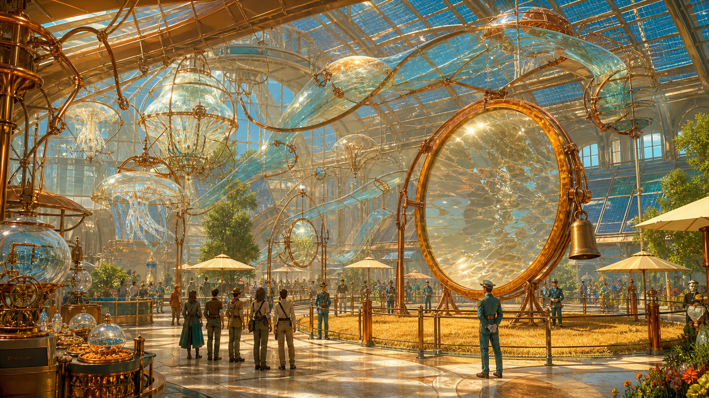
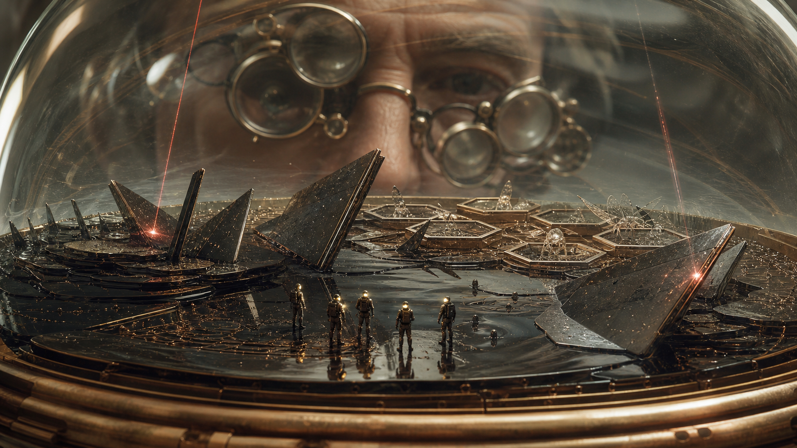
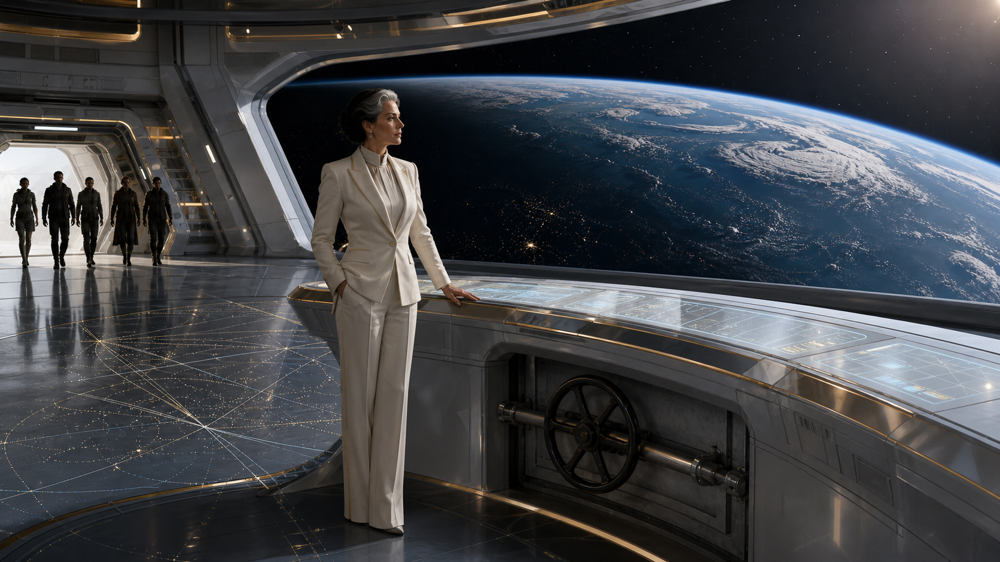
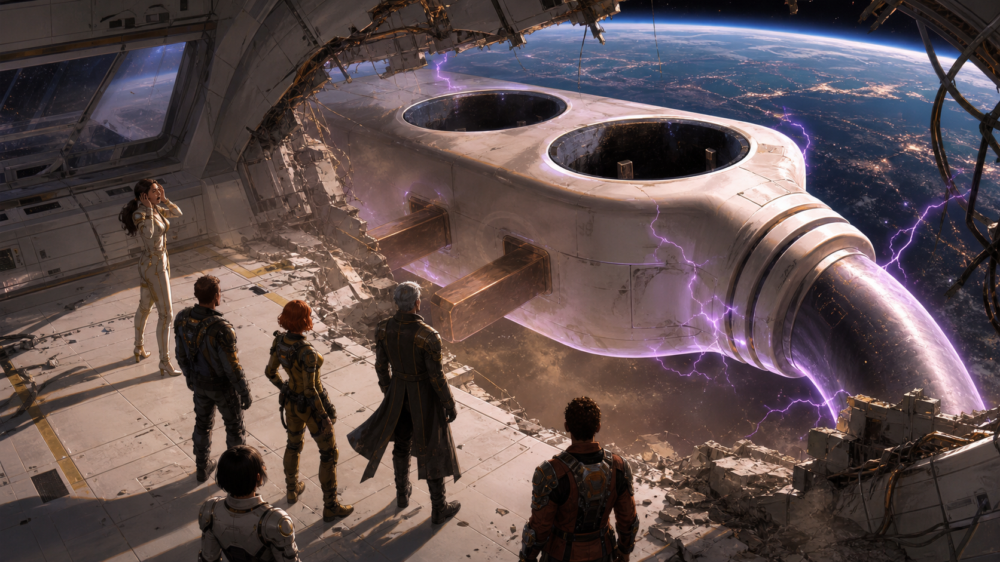

# VISUELS À RÉVÉLER

## 1 — La Guerre de l’Étoile

À montrer avant de lire le prologue. Carte-titre entièrement sans spoiler.

## 2 — Le Salon d’opticulture

À montrer dès l’introduction. Aucun spoiler.

## 3 — L’intérieur du grain

À montrer uniquement après la miniaturisation.

## 4 — La station Zénith

À montrer à l’arrivée dans la baie de commande.

## 5 — La Prise Mère

À garder cachée jusqu’à ce que la riposte ait produit un résultat visible.

