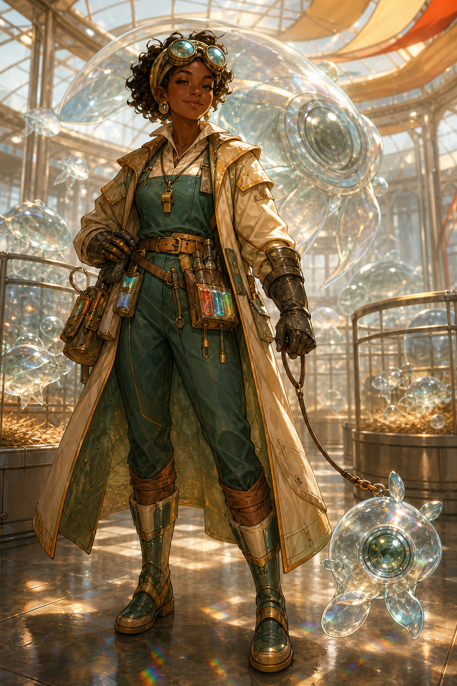

# MAËLLE « SIFFLET » PRISME
## Bergère de loupes — championne junior de courbure

> **« Une loupe ne brûle jamais quelqu'un sans raison. »**

---

# CE QUE LES AUTRES VOIENT

Tu portes des lunettes de soudeur même la nuit et tu prétends connaître le prénom de chacune des huit mille loupes de l'exploitation familiale. Tu parles aux bêtes avec davantage de patience qu'aux humains.

Tu es venue au Salon pour présenter Marguerite II, la championne de ta mère. Tu veux remporter le concours sans avoir besoin d'un seul produit Tiānguāng — ce qui est techniquement contraire au règlement.

# CARACTÉRISTIQUES

| Domaine | Bonus |
|---|---:|
| Force | +1 |
| Adresse | +1 |
| Technique | +0 |
| Science | +0 |
| Influence | +3 |
| Opticulture | +3 |

# ÉTATS

- [ ] Secouée
- [ ] Blessée
- [ ] Hors d'action

# ÉCLAT

- [ ] Éclat

# CAPACITÉ SIGNATURE — LE GRAND RAPPEL

Une fois dans la partie, toutes les loupes présentes t'obéissent immédiatement, y compris les gardes-loupes hostiles. Décris le chant, le sifflet ou le geste qu'elles reconnaissent.

# COUP D'ÉCLAT — JE CONNAIS SON NOM

Dépense un Éclat face à une créature optique. Le MJ te révèle immédiatement :

- ce qu'elle veut maintenant ;
- ce qui lui fait peur ;
- ce qui pourrait gagner sa confiance.

# ATOUT — L'APPEL DU TROUPEAU

Lorsque des loupes domestiquées se trouvent à proximité, tu peux les attirer, les calmer ou leur faire suivre une lumière simple. Elles restent des animaux : elles ne comprennent pas un plan complexe et peuvent paniquer si elles sont blessées.

# ÉQUIPEMENT

- sifflet d'élevage à six tons ;
- trois gels phosphorescents ;
- gant anti-focale ;
- laisse à courbure variable ;
- lunettes de soudeur renforcées ;
- cloche de Marguerite II.

# TON SECRET — NE LE LIS PAS AUX AUTRES

Marguerite II appartient à la troisième et dernière génération autorisée par sa licence. Ta famille n'a pas les moyens d'acheter une nouvelle souche fertile. Tu as modifié sa date de naissance pour gagner quelques mois ; Iris a fait disparaître l'alerte administrative.

Si la fraude est découverte, l'exploitation familiale peut perdre tout son troupeau.

# TES LIENS

**Noé :** il a sauvé votre serre avec une manivelle. Tu lui confierais une machine, jamais un animal.  
**Iris :** elle a effacé une alerte sur la licence de Marguerite, mais sa famille a écrit cette règle.  
**Sacha :** il sait que les comptes de l'exploitation vont mal. Tu ignores si son amitié est plus forte qu'un scoop.

# TON DILEMME

Veux-tu sauver les loupes en détruisant le métier qui a défini toute ta famille ?

# TA FAÇON D'AGIR

Quand le groupe hésite face à une créature, rappelle que tu peux observer ses besoins, gagner sa confiance ou détourner son attention. Tu défends le vivant, même lorsqu'il est encombrant ou dangereux.

## Notes

____________________________________________________________

____________________________________________________________
