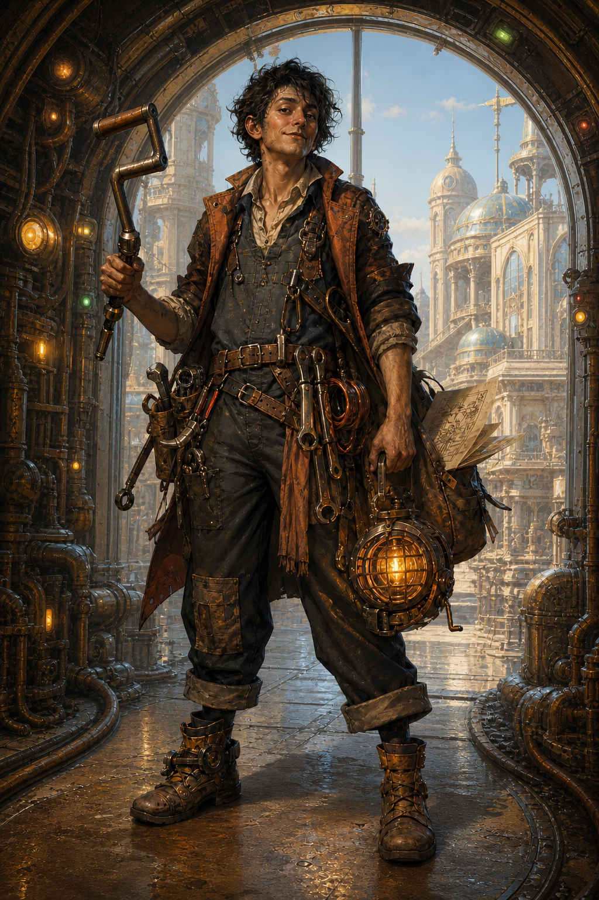
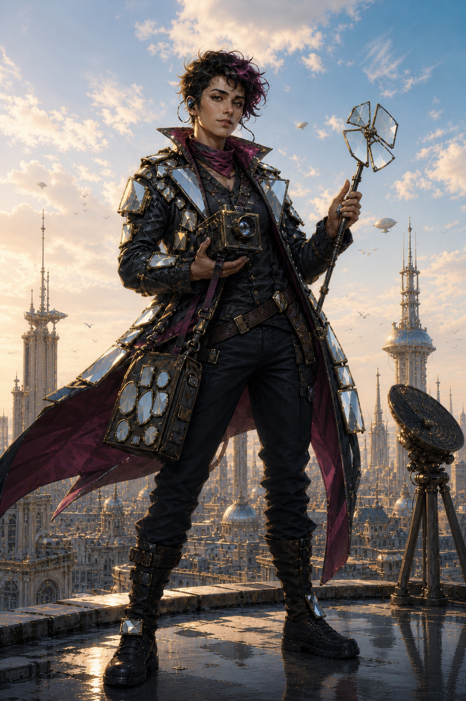

# LA GUERRE DE L'ÉTOILE
## Direction artistique et prompts sans spoiler des personnages

Les six portraits ont été générés avec l'outil intégré de génération d'images. Ils représentent tous le monde **avant l'incident** : aucune image de joueur ne montre l'éclipse, les miroirs, la rallonge ou les extraterrestres. Les fichiers finaux se trouvent dans [`images/personnages/`](images/personnages/).

---

# DIRECTION COMMUNE

**Usage :** portrait vertical pleine silhouette pour une fiche de personnage JDR.  
**Univers :** science-fiction solaire rétrofuturiste, élégante et absurde, jouée sérieusement.  
**Style :** concept art peint très détaillé avec sensibilité de bande dessinée européenne, silhouette nette et éclairage cinématographique.  
**Format visuel :** vertical proche du 2:3, personnage entier, légère contre-plongée.  
**Contraintes communes :** aucun texte, aucun filigrane, aucun logo lisible, pas de caricature comique.

---

# MAËLLE « SIFFLET » PRISME


```text
Use case: stylized-concept
Asset type: vertical full-body tabletop RPG character portrait
Primary request: Maëlle “Sifflet” Prisme, a flamboyant young adult shepherd of living optical lenses in a retrofuturist solar science-fiction world.
Scene/backdrop: the International Opticulture Fair, airy glass agricultural hall, softly blurred pens containing floating translucent lens-creatures like tiny jellyfish; one large gentle prize lens-creature behind her.
Subject: confident young Black woman, practical shepherd posture, expressive warm face, oversized welding goggles pushed onto her forehead, reinforced focal-resistant glove, whistle at her neck, luminous gel treats and optical herding tools on a worn belt, stylish work coat mixing rural shepherd clothing with solarpunk protective gear. She holds a leash connected to a floating transparent living lens. Instantly readable, charismatic, high-color personality.
Style/medium: polished painterly science-fiction character concept art with elegant European graphic-novel sensibility, crisp silhouette, rich material detail, suitable for a premium French tabletop RPG book.
Composition/framing: vertical 2:3 feeling, full body, slight low angle, centered character, enough space around silhouette, living lens clearly visible.
Lighting/mood: warm concentrated sunlight creating circular highlights and prismatic caustics, adventurous, humorous world played seriously.
Color palette: warm amber, turquoise, cream, touches of red; translucent glassy creatures.
Constraints: biologically plausible fantasy lens-creatures, no text, no logo, no watermark, no extra human characters in focus, no comedy caricature, no weapon in her hands.
```

---

# NOÉ « LA MANIVELLE » VOLT



```text
Use case: stylized-concept
Asset type: vertical full-body tabletop RPG character portrait
Primary request: Noé “La Manivelle” Volt, a flamboyant young adult retro-mechanic and proud enemy of over-automated progress in a solar science-fiction world.
Scene/backdrop: an active maintenance tunnel beneath a pristine futuristic school-city during an ordinary bright day; forgotten gears and manual conduits, normal indicator lights, clear blue sky and prosperous Héliopolis visible through the doorway.
Subject: charismatic wiry young man with mischievous expression, messy dark hair, rolled sleeves, patched utility overalls under a weathered short coat, tool belt overloaded with forbidden hand tools, copper wire, universal crank handle prominently held like a heroic artifact, hand-powered dynamo lamp glowing warm amber, paper city plan protruding from a satchel. Distinctive asymmetrical silhouette and practical boots.
Style/medium: polished painterly science-fiction character concept art with elegant European graphic-novel sensibility, crisp silhouette, rich material detail, suitable for a premium French tabletop RPG book; match a coherent series with warm cinematic rendering.
Composition/framing: vertical 2:3 feeling, full body, slight low angle, centered character, generous padding.
Lighting/mood: ordinary warm daylight mixed with the glow of his hand-cranked lamp; resourceful, rebellious, humorous world played seriously.
Color palette: copper, rust orange, charcoal, petroleum blue, warm lamp gold.
Constraints: spoiler-free pre-incident scene; no eclipse, no black sun, no micro-mirrors, no spaceships, no extraterrestrials, no giant cable, no plot clues, no text, no logo, no watermark, no firearm, no extra human characters in focus, no steampunk top hat, no comedy caricature.
```

---

# IRIS QIAO — « SON ALTESSE SOLAIRE »


```text
Use case: stylized-concept
Asset type: vertical full-body tabletop RPG character portrait
Primary request: Iris Qiao, nicknamed “Her Solar Highness,” a flamboyant young adult heiress of a solar-energy empire in a retrofuturist science-fiction world.
Scene/backdrop: pristine pavilion of a futuristic solar corporation inside an opticulture fair, elegant white architecture, healthy gardens, completely ordinary blue midday sky and warm sunlight.
Subject: poised young East Asian woman with intelligent confident expression, immaculate asymmetrical white-and-gold solar uniform with subtle seven-ray geometric motifs but no readable logo, elegant photovoltaic parasol, premium secure wrist terminal, luminous badge, practical yet luxurious boots. A narrow personal shaft of golden sunlight follows her as a visible luxury service without darkening the surroundings. Strong charismatic silhouette, not a princess costume.
Style/medium: polished painterly science-fiction character concept art with elegant European graphic-novel sensibility, crisp silhouette, rich material detail, suitable for a premium French tabletop RPG book; coherent with a warm cinematic character series.
Composition/framing: vertical 2:3 feeling, full body, slight low angle, centered with generous padding, parasol fully visible.
Lighting/mood: clear warm ordinary daylight with controlled gold highlights, luxurious, confident and slightly distant.
Color palette: ivory, solar gold, pearl, pale cyan, sharp black eclipse accents.
Constraints: spoiler-free pre-incident scene; no eclipse, no black sun, no micro-mirrors, no spaceships, no extraterrestrials, no giant cable, no plot clues, no text, no readable logo, no watermark, no crown, no fantasy gown, no weapon, no extra human characters in focus, no comedy caricature.
```

---

# SACHA MIRO



```text
Use case: stylized-concept
Asset type: vertical full-body tabletop RPG character portrait
Primary request: Sacha Miro, a flamboyant young adult pirate-journalist and “walking mirror” in a retrofuturist solar science-fiction world.
Scene/backdrop: rooftop above a prosperous perfect city during an ordinary bright late afternoon, civilian delivery vehicles and birds in the distance, broadcast antenna and solar towers fully operating.
Subject: charismatic androgynous young adult with quick observant eyes and a daring half-smile, dynamic layered jacket sewn with many small folding mirrors and reflective panels, practical dark clothes, hand-cranked documentary camera held ready, telescoping mirror tool, earpiece linked to pirate frequencies, press satchel with several blank badge shapes, wind-swept short hair. The mirrors create fragmented highlights across the silhouette without obscuring the face.
Style/medium: polished painterly science-fiction character concept art with elegant European graphic-novel sensibility, crisp silhouette, rich material detail, suitable for a premium French tabletop RPG book; coherent with a warm cinematic character series.
Composition/framing: vertical 2:3 feeling, full body, slight low angle, centered, strong triangular pose, generous padding.
Lighting/mood: normal late-afternoon gold reflected across the jacket, investigative, rebellious, stylish, humorous world played seriously.
Color palette: graphite, midnight blue, silver, magenta accents, stolen warm gold highlights.
Constraints: spoiler-free pre-incident scene; no eclipse, no black sun, no occultation, no micro-mirrors, no spaceships, no extraterrestrials, no giant cable, no plot clues, no text, no readable logos, no watermark, no firearm, no eyepatch, no pirate hat, no extra human characters in focus, no comedy caricature.
```

---

# CÉLESTE « PARALLAXE » AZOULAY


```text
Use case: stylized-concept
Asset type: spoiler-free vertical full-body tabletop RPG character portrait
Primary request: Céleste “Parallaxe” Azoulay, a flamboyant young adult field astronomer and obsessive orbital cartographer in a retrofuturist solar science-fiction world, before any crisis occurs.
Scene/backdrop: bright rooftop observatory of the perfect school-city Héliopolis during an ordinary sunny day, open brass-and-glass telescope, paper star maps, small mechanical orrery; completely normal blue sky and normal sunlight.
Subject: charismatic young Mediterranean woman with intense curious expression, wild dark curls partly contained by a practical headband, round multi-filter astronomical spectacles pushed up, long midnight-blue field coat embroidered with abstract constellations, rugged boots, compact mechanical orrery backpack with orbiting brass rings, folding sextant in one hand and rolled paper charts under the other arm. Eccentric scientist-adventurer, strong readable silhouette.
Style/medium: polished painterly science-fiction character concept art with elegant European graphic-novel sensibility, crisp silhouette, rich material detail, suitable for a premium French tabletop RPG book; coherent with warm cinematic character series.
Composition/framing: vertical 2:3 feeling, full body, slight low angle, centered, generous padding, telescope secondary.
Lighting/mood: clear warm ordinary daylight, intelligent, adventurous, joyfully obsessive, humorous world played seriously.
Color palette: midnight blue, brass, burgundy, parchment cream, small cyan accents.
Constraints: spoiler-free pre-incident scene; no eclipse, no black sun, no micro-mirrors, no spaceships, no extraterrestrials, no giant cable, no ominous sky, no plot clues, no text, no logo, no watermark, no weapon, no comedy caricature.
```
